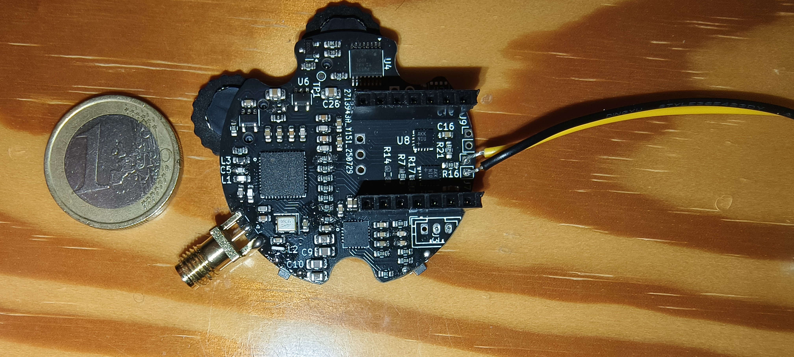
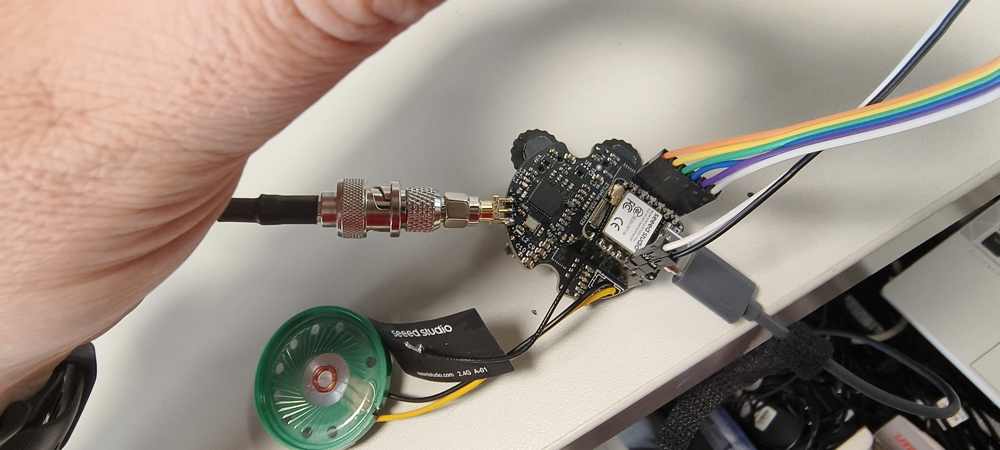
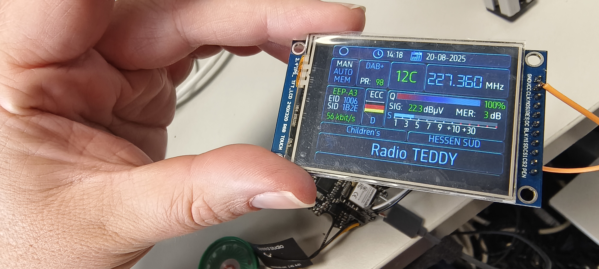
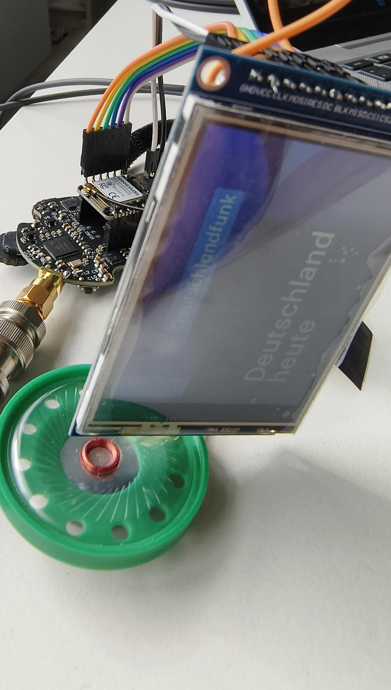

[](https://github.com/PE5PVB/TEF-Nextion-Multiband#contributing)
[](https://github.com/PE5PVB/TEF-Nextion-Multiband/blob/main/LICENSE)

# Note:
The version in the repository is an ongoing development. It could and will contain bugs. To make sure you use the latest fully tested firmware, check the releases!


# Hint:
#define USE_HSPI_PORT ... set this to active in eTFT Lib user_setup.h. otherwise it won't work

# SI4684 DAB receiver
Advanced DAB Tuner software for Skyworks SI4684 tuner with ESP32 board and a round color LCD or AMOLED\
This is a fork of the famous PE5PVB SI4684 Project, unfinished and right now still in devolpment.
Check a more developed project on the origin source: https://www.pe5pvb.nl/

# How does it look


Simulation
<p align="center"> 

</p>

Real device
<p align="center"> 

</p>


# How does work

<p align="center"> 

</p>

<p align="center"> 

</p>

Base Screen:
<p align="center"> 

</p>

DAB Slideshow
<p align="center"> 

</p>

# Libraries
These are the libraries used for this project:
- https://github.com/Bodmer/TFT_eSPI
- https://github.com/uzi18/TFT_eSPI
- https://github.com/Bodmer/JPEGDecoder
- https://github.com/bitbank2/PNGdec


Use these settings in the TFT_eSPI library:
```
#define ILI9341_2_DRIVER     // Alternative ILI9341 driver, see https://github.com/Bodmer/TFT_eSPI/issues/1172
#define TFT_WIDTH  240 // ST7789 240 x 240 and 240 x 320
#define TFT_HEIGHT 320 // ST7789 240 x 320

#define TFT_CS    38  // Chip select PIN
#define TFT_MISO  39  // MISO PIN
#define TFT_DC    40  // Data Command control pin
#define TFT_RST   41  // Reset pin (could connect 
#define TFT_MOSI  42  // MOSI PIN
#define TFT_SCLK  10  // CLK PIN
#define SPI_FREQUENCY  27000000
#define SMOOTH_FONT
#define USE_HSPI_PORT ///// THIS IS IMPORTANT OTHERWISE NO CONTACT TO DAB TUNER
#define LOAD_GFXFF  // FreeFonts. Include access to the 48 Adafruit_GFX free fonts FF1 to FF48 and custom fonts
#define SPI_READ_FREQUENCY  20000000
#define SPI_TOUCH_FREQUENCY  2500000

```
# Buttons
A brief instruction for the buttons:
- Top encoder: Choose frequency or memory channel
- Bottom encoder: Choose service or set headphones volume
- Top button: Short press: Service information, Long press: Stand-by mode. (Not in use right now)
- Middle button: Short press: Set mode, Long press: Open menu.
- Lower button: Toggle Slideshow view.
  
## Contributing
I'm open for a new ideas in our project. Feel free to share your thoughts in 

You are using my software and you found a difficulty? Please create new [issue] and describe your problem.

I also would like to invite you to join our Discord community where we share our ideas and help each other with some issues.\
[](https://discord.gg/ZAVNdS74mC)  

Special thanks to all [contributors](https://github.com/PE5PVB/TEF-Nextion-Multiband/graphs/contributors). You are awesome! ❤️
## License
This program is free software; you can redistribute it and/or modify it under the terms of the GNU General Public License as published by the Free Software Foundation; either version 3 of the License, or (at your option) any later version.

This program is distributed in the hope that it will be useful, but WITHOUT ANY WARRANTY; without even the implied warranty of MERCHANTABILITY or FITNESS FOR A PARTICULAR PURPOSE. See the GNU General Public License for more details. 

## If you like this software. Contriubute to 
<a href="https://www.buymeacoffee.com/pe5pvb"></a>
